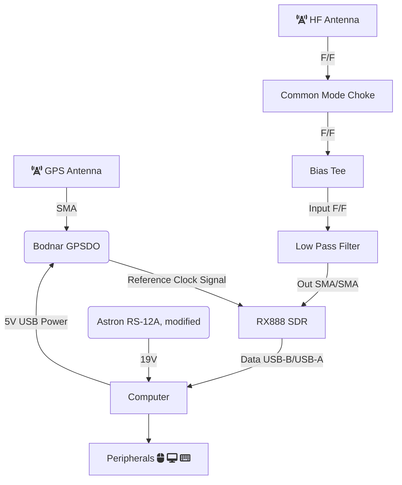

## Introduction
{:.no_toc}
Put your build instructions here! Use lots of photos and detail.

## Table of Contents 
{:.no_toc}
* TOC
{:toc}

The standard antenna at the time of writing is the DX Engineering [RSEAV-1](https://www.dxengineering.com/parts/dxe-rseav-1).

For a roof installation: https://www.dxengineering.com/parts/dxe-rf-pro-1b

